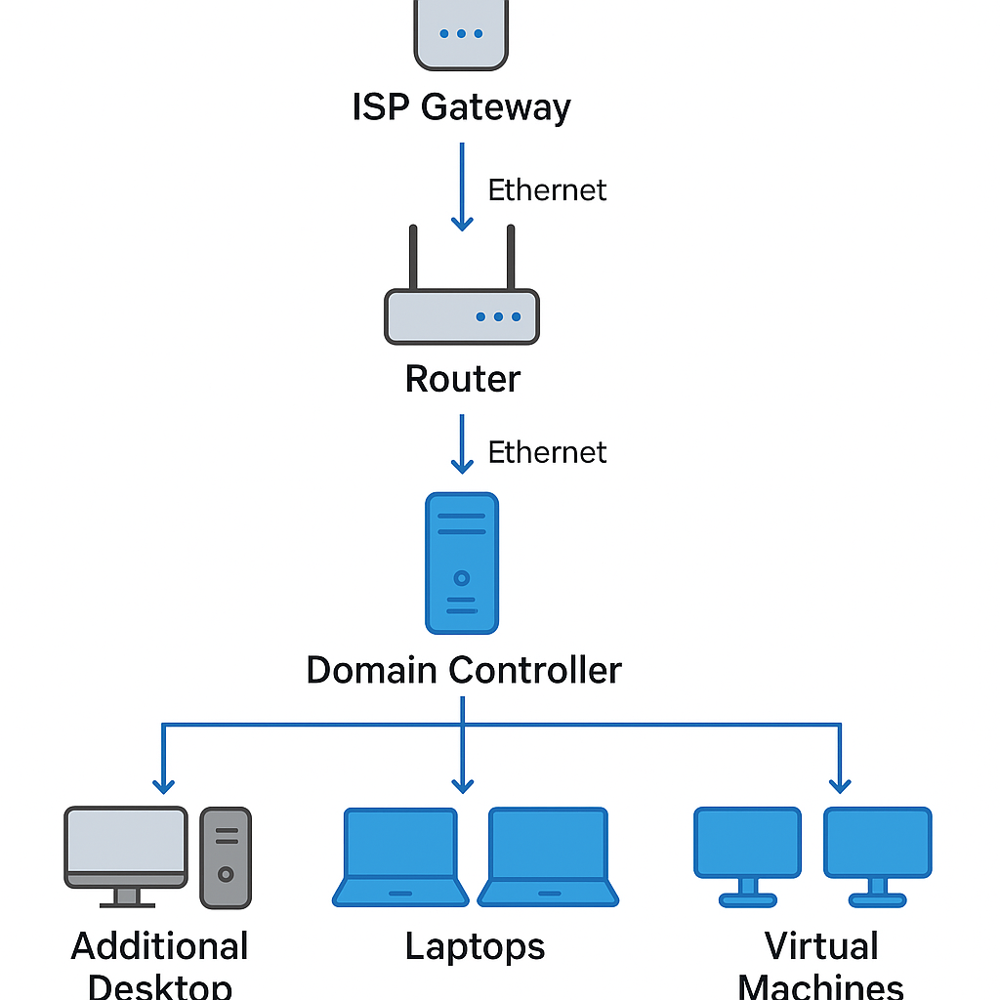
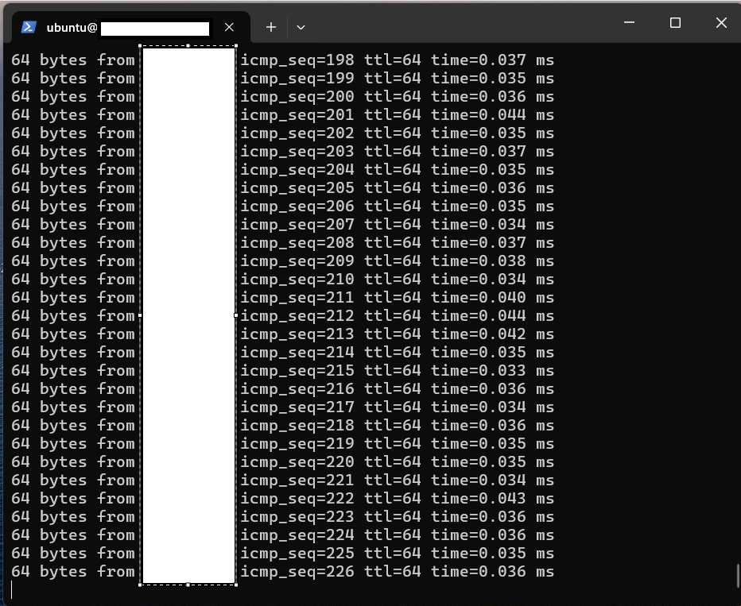
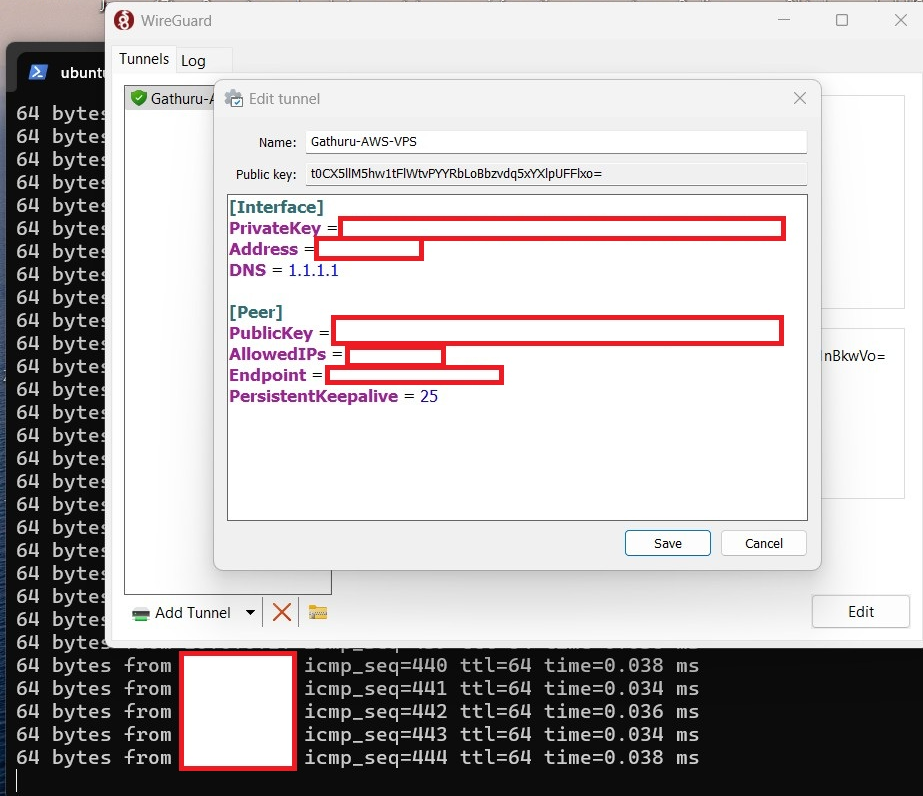
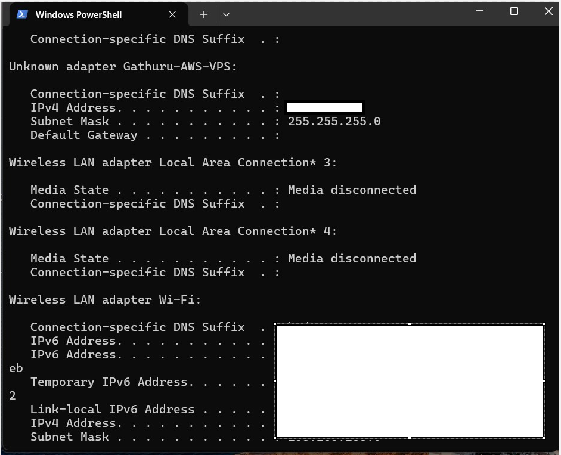

# VPN-HomeLab-Project

This project demonstrates how I set up a secure VPN tunnel using WireGuard and an AWS EC2 instance to access my home network and Homelab (including my Domain Controller) from a Windows laptop.

---

## 🚀 Overview

**Tools Used:**

- AWS EC2 (Ubuntu 22.04)
- Windows 11 client
- WireGuard VPN
- RDP and ping for testing

---

## 🛠️ Setup Summary

1. Launched AWS EC2 (Ubuntu) and opened port `51820/UDP`
2. Installed WireGuard on server and Windows client
3. Generated keys, configured `wg0.conf`
4. Enabled IP forwarding and routing
5. Verified VPN tunnel and tested access to Homelab via ping and RDP

---

## 🖼️ Screenshots

## Screenshots

### Homelab Setup

### Ping Success

### AWS EC2 Instance

### WireGuard Configuration

## 📡 IP Configuration Example

All IPs and sensitive values have been blurred or replaced.

---

## 📄 License

