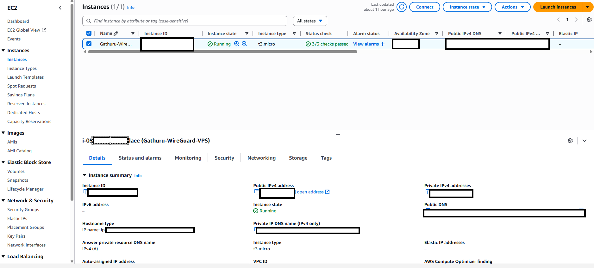
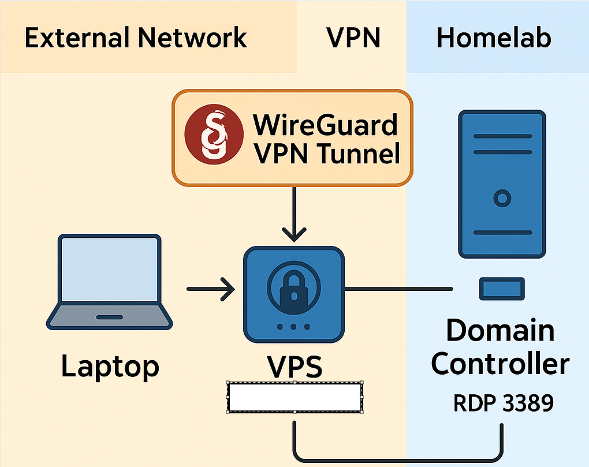

# VPN-HomeLab-Project

This project demonstrates how I set up a secure VPN tunnel using WireGuard and an AWS EC2 instance to access my home network and Homelab (including my Domain Controller) from a Windows laptop.

---

## 🚀 Overview

**Tools Used:**

- AWS EC2 (Ubuntu 22.04)
- Windows 11 client
- WireGuard VPN
- RDP and ping for testing

---

## 🛠️ Setup Summary

1. Launched AWS EC2 (Ubuntu) and opened port `51820/UDP`
2. Installed WireGuard on server and Windows client
3. Generated keys, configured `wg0.conf`
4. Enabled IP forwarding and routing
5. Verified VPN tunnel and tested access to Homelab via ping and RDP

## 🧠 Skills Demonstrated
- VPN and encryption fundamentals (WireGuard)
- Cloud infrastructure setup (AWS EC2)
- Linux server administration (Ubuntu)
- Remote network access and routing
- Windows RDP configuration and testing
- Network diagramming and documentation
---

## 🖼️ Screenshots

## Screenshots

### Homelab Setup

### Ping Success

### AWS EC2 Instance

### WireGuard Configuration

## 📡 IP Configuration Example

## 🔒 WireGuard VPN Setup

---

## 🧾 Reflection
This project taught me how to troubleshoot remote connectivity issues, configure firewall rules, and securely access my Homelab resources. It reinforced practical IT support and networking concepts I studied in my coursework.

All IPs and sensitive values have been blurred or replaced.

---

## 📄 License

## 📘 Documentation  
[🔗 VPN Setup Process](docs/PROCESS)

---
## 👨‍💻 About the Author

I'm George Gathuru, a U.S. Army Veteran transitioning into cybersecurity and IT. I’m passionate about hands-on learning and building practical home lab projects like this VPN tunnel using AWS and WireGuard. [Connect with me on LinkedIn](https://www.linkedin.com/in/george-gathuru-010a01319)

